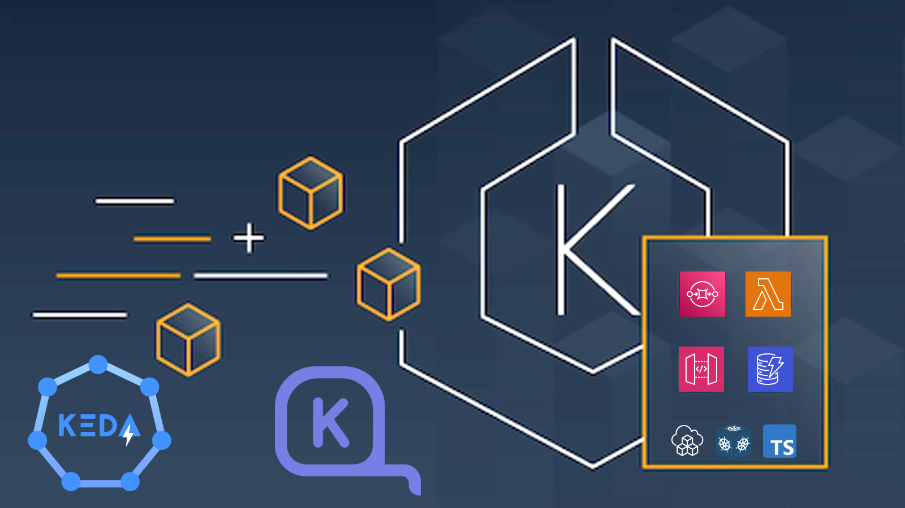

<p align="center">
  <a href="https://dev.to/vumdao">
    
  </a>
</p>
<h1 align="center">
  <div><b>Run event-driven workflows with Amazon EKS, Keda and Karpenter</b></div>
</h1>

## Assignment
- Implement a kubernetes solution to contanerize the project that will be shared along with this problem.
- Implement a very simple API server with the following routes that can interact with kubernetes.
  - `POST /jobs`  			(Create a new job that runs on a kubernetes cluster)
  - `GET /jobs/stats`  		(Returns aggregate job stats. Succeeded vs failed and  no of retries)
  - `POST  /jobs/schedule`		(Schedule a job using cron syntax)
- The project is wrritten in Rust and we need to containerize the project to serve following
  - Each job should spawn a docker container and run Rust function from binary script.
  - If the job fails, retry 2 times with a small time delay ideally.

## Abstract
- This post demonstrates a proof-of-concept implementation that uses Kubernetes to execute code in response to an event here is API request. The workflow is powered by [Keda](https://keda.sh/) (Kubernetes Event-driven Autoscaling) which scales out the kubernetes pods bases on incoming events such as SQS messages. After keda scaleout pods which are in pending state, [Karpenter](https://karpenter.sh/) (Just-in-time Nodes for Any Kubernetes Cluster) bases on provisioners to decide scaleout more nodes
- Keda and Karpenter AddOn with [Amazon Elastic Kubernetes Service](https://aws.amazon.com/eks/) (Amazon EKS), making it easy to build event-driven workflows that orchestrate jobs running on Kubernetes with AWS services, such as AWS Lambda, HTTP API Gateway, DynamoDB and Amazon Simple Queue Service (Amazon SQS), with minimal code.
- All AWS resources as well as kubernetes manifest and kubernetes AddOns are managed and installed using [CDK](https://aws.amazon.com/cdk/) (AWS Cloud Development Kit) and [CDK8S](https://cdk8s.io/) (Cloud Development Kit for Kubernetes)

**TL;DR**

## Table Of Contents
 * [Solution overview](#Solution-overview)
 * [Containerize the project](#Containerize-the-project)
 * [Create K8S Charts for keda scaledJob, provisioner and serviceAccount](#Create-K8S-Charts-for-keda-scaledJob,-provisioner-and-serviceAccount)
 * [Create EKS Cluster and other resourses using CDK EKS blueprints](#Create-EKS-Cluster-and-other-resourses-using-CDK-EKS-blueprints)
 * [Test API](#Test-API)
 * [Conclusion](#Conclusion)

---

## 🚀 **Solution overview** <a name="Solution-overview"></a>
- [Bootstrapping clusters with EKS Blueprints](https://aws.amazon.com/blogs/containers/bootstrapping-clusters-with-eks-blueprints/), the cluster includes AddOns such as Keda, Karpenter and others

  

- The API server is hosted by HTTP API gateway with lambda integration
  - `POST /jobs` - Lambda function send SQS message, keda scaledJob listens to the SQS queue and then scaleout job to serve the request, karpenter catches pod pending event to provision new node
  - `GET /jobs/stats` - Lambda function query dynamoDB table to get job aggregation stats and return the result for job succeed, failed and number of retries.
  - `POST  /jobs/schedule` - Lambda function create eventbridge `Schedule` rule with Cron expression from the input of cron syntax. Eventbridge rule will send SQS message for triggering keda scaledjob

  

## 🚀 **Containerize the project** <a name="Containerize-the-project"></a>
- [Source code](https://github.com/vumdao/dozer-process-data-api/tree/master/data_processor)
  ```
  ⚡ $ tree data_processor/
  data_processor/
  ├── Cargo.toml
  ├── Dockerfile
  ├── README.md
  └── src
      └── main.rs
  1 directory, 5 files
  ```

- In the `main.rs` there are three main tasks in this project
  1. Processing job
  2. Consume and delete SQS message
  3. Write succeed, fail and retry state to dynamodb

- We leverage multi-stage builds in [Dockerfile](https://github.com/vumdao/dozer-process-data-api/blob/master/data_processor/Dockerfile) to optimize the image size and running process as non-root user for security.
  - First stage compile Rust source code to binary `data-processor-sample`
  - Last stage copy binary and define the `ENTRYPOINT ["/data-processor-sample"]` under `USER rust` so whenever the container starts, it automatically trigger processing jobs.

- Build, tag and push image
  ```
  ⚡ $ cd data_processor/
  ⚡ $ docker build -t dozer/process-job .
  Sending build context to Docker daemon  52.74kB
  Successfully built 8b8178a8f41f
  Successfully tagged dozer/process-job:latest

  ⚡ $ docker tag dozer/process-job:latest 123456789012.dkr.ecr.ap-southeast-1.amazonaws.com/dozer/process-job:latest

  ⚡ $ docker push 123456789012.dkr.ecr.ap-southeast-1.amazonaws.com/dozer/process-job:latest
  ```

## 🚀 **Create K8S Charts for keda scaledJob, provisioner and serviceAccount** <a name="Create-K8S-Charts-for-keda-scaledJob,-provisioner-and-serviceAccount"></a>
- If you know helm chart or kustomize to provision managed kubernetes manifest at scale, CDK8S not only provide those benefits but also more
  - cdk8s is an open-source software development framework for defining Kubernetes applications and reusable abstractions using familiar programming languages here I use TypeScript
  - We can combine CDK and CDK8S to single project and apply CDK8S Charts inside the EKS cluster stacks and then just run deploy
  ```
  ⚡ $ tree aws-k8s-iac/src/cdk8s/
  aws-k8s-iac/src/cdk8s/
  ├── imports
  │   ├── k8s.ts
  │   ├── karpenter.sh.ts
  │   └── keda.sh.ts
  ├── karpenter-provisioner
  │   ├── dozer-job-provisoner.ts
  │   └── provisioner-constants.ts
  ├── keda
  │   └── dozer-job.ts
  ├── main.ts
  └── serviceAccount
      └── processor-job-sa.ts

  4 directories, 8 files
  ```

- For designing event-driven with autoscaling and cost optimization, we use Keda [scaledJob](https://keda.sh/docs/2.8/concepts/scaling-jobs/) with SQS triggers. In the scaledJob, we define following specs
  - `jobTargetRef` which contains the k8s job spec
  - `pollingInterval` which is the period of polling to the SQS queue
  - `minReplicaCount` is set to 0 means no SQS message no job
  - `maxReplicaCount` to control the max number of scaled jobs so first come first serve
  - `triggers` defines SQS target to poll for messages
  - `serviceAccountName` IAM role for accessing AWS resources

  - Source code: [dozer-job.ts](https://github.com/vumdao/dozer-process-data-api/blob/master/aws-k8s-iac/src/cdk8s/keda/dozer-job.ts)
  - Check scaledobject created
    ```
     ~ $ k get scaledjob
    NAME        MAX   TRIGGERS        AUTHENTICATION   READY   ACTIVE   AGE
    dozer-job   4     aws-sqs-queue                    True    False    24h
    ```

- For autoscaling, we use  Karpenter with proper provioner spec. The provisoner includes following major spec
  - `instanceProfile` AWS instance profile with enough IAM permissions for nodes to join EKS cluster
  - `amiFamily` Use `Bottlerocket` for optimize AMI and security
  - `subnetSelector` Provide tags of EKS private subnets
  - `securityGroupSelector` Provide tags of EKS security group for pods communication
  - `ttlSecondsAfterEmpty` delete empty/unnecessary instances
  - `requirements`
    - Use spot instances with proper instance type
    - Taint the EKS nodes with proper key-values for the project

  - Source code: [dozer-job-provisoner.ts](https://github.com/vumdao/dozer-process-data-api/blob/master/aws-k8s-iac/src/cdk8s/karpenter-provisioner/dozer-job-provisoner.ts)
  - Check provisioner created
    ```
    ~ $ k get provisioner
    NAME        AGE
    dozer-job   23h
    ```

- ServiceAccount which associates with IAM role for serviceAccount, it's best practice to provide service permissions to access AWS resources, [processor-job-sa.ts](https://github.com/vumdao/dozer-process-data-api/blob/master/aws-k8s-iac/src/cdk8s/serviceAccount/processor-job-sa.ts)
  ```
  ~ $ k get sa
  NAME        SECRETS   AGE
  default     1         4d16h
  dozer-job   1         23h
  ```

## 🚀 **Create EKS Cluster and other resourses using CDK EKS blueprints** <a name="Create-EKS-Cluster-and-other-resourses-using-CDK-EKS-blueprints"></a>
- We use CDK typescript to provide Infrastructure as code
  ```
  ⚡ $ tree aws-k8s-iac/src/
  aws-k8s-iac/src/
  ├── apigw-lambda-sqs.ts
  ├── ddb.ts
  ├── ecr.ts
  ├── eks-blueprints
  │   ├── builder.ts
  │   ├── eks-blueprint.ts
  │   └── platform-user.ts
  ├── irsa.ts
  ├── lambda-handler
  │   └── index.py
  ├── main.ts
  └── shared
      ├── configs.ts
      ├── constants.ts
      ├── environment.ts
      └── tagging.ts

  8 directories, 21 files
  ```

- Overview of CDK stacks
  ```
  ⚡ $ cdk ls
  DevEksCluster
  DevEksCluster/sin-DozerDDB
  DevEksCluster/sin-DozerECR
  DevEksCluster/sin-DozerProcessData
  DevEksCluster/sin-d1-dev-eks-blueprint
  DevEksCluster/sin-DozerIRSA
  ```

- After creating `.env` with `CDK_DEFAULT_ACCOUNT` and `CDK_DEFAULT_REGION` we can run `cdk deploy --all` to create resources. Check cloudformation

  

- Overview of all components

  

## 🚀 **Test API** <a name="Test-API"></a>
- Overview of HTTP API Gateway

  

- Create a new job that runs on a kubernetes cluster
  - Send `POST` request
  ```
  curl -X POST https://ww47is207g.execute-api.ap-southeast-1.amazonaws.com/jobs
  200
  ```

  - Keda scales job and Karpenter scale node
    - New node joined
      ```
      ~ $ k get node
      NAME                                              STATUS   ROLES    AGE    VERSION
      ip-10-0-103-57.ap-southeast-1.compute.internal    Ready    <none>   52s    v1.21.13
      ip-10-0-118-81.ap-southeast-1.compute.internal    Ready    <none>   122m   v1.21.13
      ip-10-0-151-134.ap-southeast-1.compute.internal   Ready    <none>   122m   v1.21.13
      ```
    - Job created
      ```
      ~ $ k get pod --watch
      NAME                    READY   STATUS    RESTARTS   AGE
      dozer-job-kl8kd-dmq85   0/1     Pending   0          22s
      dozer-job-kl8kd-dmq85   0/1     ContainerCreating   0          23s
      dozer-job-kl8kd-dmq85   1/1     Running             0          68s
      dozer-job-kl8kd-dmq85   0/1     Completed           0          74s
      dozer-job-9qxrm-s8p6p   0/1     Pending             0          0s
      dozer-job-9qxrm-s8p6p   0/1     ContainerCreating   0          0s
      dozer-job-9qxrm-s8p6p   1/1     Running             0          2s
      dozer-job-9qxrm-s8p6p   0/1     Error               0          7s
      dozer-job-9qxrm-9m27d   0/1     Pending             0          0s
      dozer-job-9qxrm-9m27d   0/1     ContainerCreating   0          0s
      dozer-job-9qxrm-9m27d   1/1     Running             0          1s
      dozer-job-9qxrm-9m27d   0/1     Error               0          2s
      dozer-job-9qxrm-5d4vc   0/1     Pending             0          0s
      dozer-job-9qxrm-5d4vc   0/1     ContainerCreating   0          0s
      dozer-job-9qxrm-5d4vc   1/1     Running             0          2s
      dozer-job-9qxrm-5d4vc   0/1     Error               0          3s
      ```

- Get job aggregation stats
  - Send `GET` request
    ```
    ~ $ curl -X GET https://ww47is207g.execute-api.ap-southeast-1.amazonaws.com/jobs/stats
    {"succeedJob": 1, "jobRetry": 2, "failedJob": 3}
    ```

  - Double check dynamoDB table

    

- Schedule a job using cron syntax
  - Send `POST` request
    ```
    curl -X POST https://ww47is207g.execute-api.ap-southeast-1.amazonaws.com/jobs/schedule --data '{"cron": "* * * * *"}' --header "Content-Type: application/json"
    200

    ~ $ curl -X POST https://ww47is207g.execute-api.ap-southeast-1.amazonaws.com/jobs/schedule --data '{"cron": "0 7 * * MON"}' --header "Content-Type: application/json"
    200
    ```

  - Check eventbridge schedules

    

    

  - Let the schedule of triggering per minute run for a while and then check job stats again
    ```
    ~ $ curl -X GET https://ww47is207g.execute-api.ap-southeast-1.amazonaws.com/jobs/stats
    {"succeedJob": 13, "jobRetry": 12, "failedJob": 15}
    ```

## 🚀 **Conclusion** <a name="Conclusion"></a>
- This post showed how to run event-driven workflows using API request at scale on Amazon EKS, HTTP APIGW and AWS Lambda. We provided you with AWS CDK code as well as CDK8S code to create the cloud infrastructure, Kubernetes resources, and the application within the same codebase.
- In real project, we can do some improvements
  - `POST` job request will base on the request ID to separate which job ID, which user triggered
  - Security the API endpoint
  - Implement CDK pipeline for the codebase

---

<h3 align="center">
  <a href="https://dev.to/vumdao">:stars: Blog</a>
  <span> · </span>
  <a href="https://github.com/vumdao/dozer-process-data-api">Github</a>
  <span> · </span>
  <a href="https://stackoverflow.com/users/11430272/vumdao">stackoverflow</a>
  <span> · </span>
  <a href="https://www.linkedin.com/in/vu-dao-9280ab43/">Linkedin</a>
  <span> · </span>
  <a href="https://www.linkedin.com/groups/12488649/">Group</a>
  <span> · </span>
  <a href="https://www.facebook.com/CloudOpz-104917804863956">Page</a>
  <span> · </span>
  <a href="https://twitter.com/VuDao81124667">Twitter :stars:</a>
</h3>
